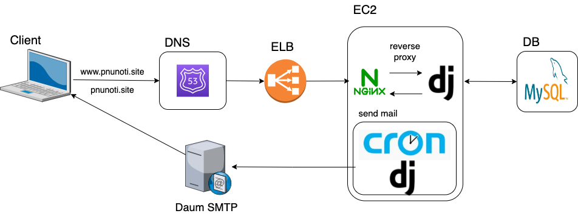

# PNU-Notification
[학교 공지사항을 손쉽게 메일로 전송해주는 웹 어플리케이션 프로젝트](https://www.pnunoti.site)<br>

-----
## 설명

-----
부산대 학우분들을 위한 어플리케이션입니다.<br>
사용법은 다음과 같습니다. <br>
1. 웹사이트를 통해 학생들이 직접 특정 학과의 게시판 RSS 주소를 등록
2. 등록 후 30분 단위마다 해당 게시판의 RSS 데이터를 확인해 변경확인 시 메일전송
3. 취소는 웹사이트에서 구독 여부 토글 스위치를 ON/OFF하는것으로 제어 가능

## 프로그램 구조도

-----


## Architecture Spec
```
AWS EC2 t3.small(VCPU2, RAM 2GB)
AWS RDB MySQL t3.small(VCPU2, RAM 2GB, 50GB)
```
## Requirements

-----
- python>=3.10.x
- django>=4.0

## 팀원

-----
- Train0303
- nimunsang
